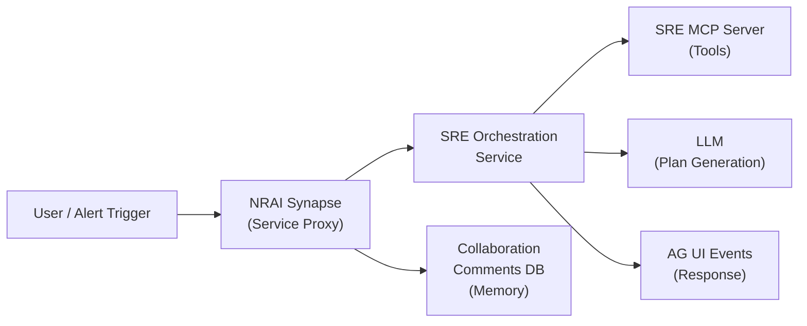
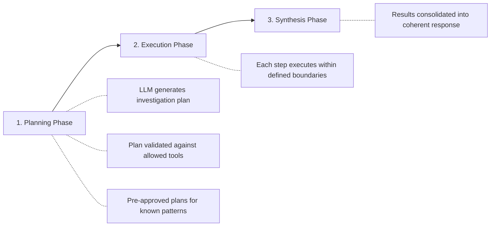
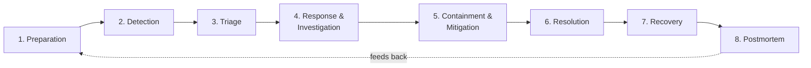

# New Relic SRE Agent — Comprehensive Understanding

A synthesis of all documents found in the PM-OS context library under `SRE Agent/`.

---

## Documents Reviewed

| Document | Location | Purpose |
|---|---|---|
| **SRE Agent CDD** | [CDD](file:///Users/abhishekpandey/Desktop/PM-OS/context-library/SRE%20Agent/New%20Relic%20SRE%20Agent/2025_04_08+-+SRE+Agent+CDD%20%281%29.doc) | Core design document — architecture, APIs, teams |
| **Observability Research** | [Research](file:///Users/abhishekpandey/Desktop/PM-OS/context-library/SRE%20Agent/SRE%20Agent%20Research/observability_sre_agents_research.md) | Market landscape, competitive analysis |
| **UX Research** | [UX](file:///Users/abhishekpandey/Desktop/PM-OS/context-library/SRE%20Agent/SRE%20Agent%20Research/sre_agent_ux_research.md) | Interaction paradigms, trust patterns |
| **Workflow Questions** | [Workflows](file:///Users/abhishekpandey/Desktop/PM-OS/context-library/SRE%20Agent/SRE%20Agent%20Research/sre_workflow_critical_questions.md) | 8-phase incident lifecycle, pain points |
| **Internal Docs (5 files)** | [Internal](file:///Users/abhishekpandey/Desktop/PM-OS/context-library/Internal%20Docs-%20New%20Relic/New%20Relic%20SRE%20Agent_v1/) | CDD, User Control Enhancement, MCP Tools, InfoSec, AI Evaluation |

---

## 1. What Is the New Relic SRE Agent?

An **AI-powered SRE agent** built by the **AEON team** at New Relic, designed to proactively speed up detection and resolution of problems using New Relic observability data.

### Core Domains

| Domain | User Question It Answers |
|---|---|
| **Alert Triage** | "I was paged for entity X. Is this alert concerning?" |
| **Entity Health** | "How is service X doing?" |
| **Change Intelligence** | "Is the last deployment for service X stable and healthy?" |
| **Incident Analysis** | "Entity X is down. What caused this outage?" |
| **Remediation** | "The latest deployment is awful. What can you do to fix it?" |

### Key Pivot (Nov 2025)

The AEON team made a notable pivot in approach — moving from DAG-based workflows (chat + LLM routing) to a **"controlled non-determinism"** architecture using MCP tools and a dedicated orchestration service.

---

## 2. Architecture & Design

### High-Level Architecture



### Core Components

| Component | Role |
|---|---|
| **NRAI Synapse** | Service proxy for all SRE agent interactions; handles identity tokens and stores responses in Collaboration comments DB (conversational memory) |
| **SRE Orchestration Service** | Implements "controlled non-determinism" — generates plan, executes steps, synthesizes output |
| **SRE MCP Server** | Hosts SRE-oriented MCP tools that the agent can invoke |
| **NGEP Entities** | `AiAgentEntity` (NR org, internal details) and `NrAiAgentEntity` (customer org) manage onboarding/discovery |

### Source Repositories

- `source.datanerd.us/mind/agentic-platform`
- `source.datanerd.us/Alerting/sre-agent-mcp-server`
- `source.datanerd.us/Alerting/sre-agent-configs`
- `source.datanerd.us/Alerting/sre-orchestration-service`

### Three-Phase Execution Model



**Key design choice**: "Controlled non-determinism" — the LLM generates a flexible plan, but execution is constrained within safety boundaries (circuit breakers, token budgets, retry strategies).

### API Schema (AG UI Compatible)

**Request** follows AG UI's `RunAgentInput`:
- `threadId` — conversation GUID
- `runId` — message response GUID
- `messages` — past messages or initial trigger

**Response** follows AG UI's `BaseEventSchema` with event types including:
`TEXT_MESSAGE_*`, `THINKING_*`, `TOOL_CALL_*`, `STATE_*`, `RUN_*`, `STEP_*`, `CUSTOM`

### Teams Involved

| Team | Responsibility |
|---|---|
| **AEON** | Core agent development |
| **Collaboration** | Comments DB / memory storage |
| **WIN** | AI Agent Alerts destination |

---

## 3. Competitive Landscape

### Major Players (from observability research)

| Player | Product | Status | Key Differentiator |
|---|---|---|---|
| **Datadog** | Bits AI SRE Agent | GA Dec 2025 | Data moat (billions of daily data points), voice interface |
| **Dynatrace** | Davis AI + Intelligence Agents | Announced 2026 | Deterministic + agentic AI hybrid, phased autonomy roadmap |
| **PagerDuty** | SRE Agent + Suite | GA Q4 2025 | Deepest Slack integration, virtual responder concept |
| **Splunk (Cisco)** | AI Troubleshooting Agent | Q1 2026 | MCP Server, MELT correlation |
| **Grafana** | Assistant + Investigations | GA/Preview 2025 | Best "show your work" transparency, open-source DNA |
| **Microsoft Azure** | Azure SRE Agent | GA Mar 2026 | Most sophisticated autonomy configuration, cloud-native |
| **New Relic** | SRE Agent + MCP Server | Coming 2026 | MCP-based tools, controlled non-determinism |

### Startups to Watch

- **incident.io** — Chat-native Slack-first with ~90% accuracy, source citation
- **Rootly** — 50-70% MTTR reduction claims
- **Cleric, Resolve.ai, Parity, Ciroos** — Various AI SRE approaches

### Key Industry Trends

1. **The Agentic Shift** — AI agents moving from assistants to autonomous operators
2. **OpenTelemetry (OTel)** — De facto standard for unified telemetry
3. **The Trust Paradox** — Despite AI adoption, operational toil *increased* in 2024-2025
4. **Observability for AI** — Monitoring AI models themselves (hallucinations, token costs, drift)
5. **Evolving SRE Role** — SREs becoming "architects of reliability"

---

## 4. UX Research Insights

### Four UX Archetypes

| Archetype | Description | Who Uses It |
|---|---|---|
| **Chat-Native** | Full lifecycle inside Slack/Teams | incident.io, PagerDuty, Rootly |
| **Sidebar Copilot** | Context-aware AI panel alongside dashboards | Grafana Assistant, Dynatrace Copilot |
| **Dashboard-Embedded** | AI woven into existing views | Datadog Bits AI, Splunk |
| **Autonomous Background Agent** | Silent investigation, surfaces results | Azure SRE Agent, Grafana Investigations |

Most products are converging toward **hybrid models** combining 2-3 archetypes.

### The Autonomy Spectrum (Critical UX Pattern)

```
[Notify Only] → [Recommend] → [Act with Approval] → [Act within Guardrails] → [Fully Autonomous]
     ↑              ↑                ↑                        ↑                       ↑
  PagerDuty    Grafana Asst    PagerDuty SRE         Azure SRE Agent           Datadog Bits AI
  (alerts)    (suggestions)    (virtual resp)         (configurable)           (auto-investigate)
```

> [!IMPORTANT]
> The "Autonomy Dial" is the most critical UX pattern. Users need per-action (not just global) control over how much agency they grant the AI.

### Trust-Building Patterns

| Pattern | Best Implementation |
|---|---|
| Source Citation | incident.io |
| Query Transparency | Grafana |
| Live Investigation View | Grafana Investigations |
| Audit Logs | Azure SRE Agent |
| Intent Preview | Azure SRE Agent |
| Reasoning Chains | Datadog (partial) |
| Feature Adoption Dashboards | Dynatrace |

### UX Maturity Model

| Level | Description | Current Products |
|---|---|---|
| **L1** | Alert Relay | Legacy monitoring |
| **L2** | Smart Triage | PagerDuty, Splunk |
| **L3** | Co-Investigation | Grafana, Dynatrace, incident.io |
| **L4** | Autonomous Resolution | Datadog, Azure SRE Agent |
| **L5** | Predictive Prevention | Dynatrace/Datadog (vision) |

---

## 5. SRE Workflow Analysis

### 8-Phase Incident Lifecycle



### Critical Pain Points (2025 Survey Data)

| Pain Point | Stat |
|---|---|
| Toil increasing despite AI | 57% spend >50% on manual tasks |
| Alert fatigue #1 obstacle | 33% of engineers |
| False positive rate increasing | 73% say top challenge |
| Too many tools | 89% have tool sprawl |
| AI hasn't reduced toil yet | Toil up 6% in 2024 |
| Post-incident stress | 28% increased stress after incidents |

### The Investigation Journey (Phase 4 — highest cognitive effort)

```
🚨 Alert → 📊 Dashboards → 📈 Metrics → 📝 Logs → 🔗 Traces → 🔄 Correlate → 💡 Hypothesis → Test → Fix/Retry
```

> [!CAUTION]
> **Correlation is the hardest part** — connecting deployment changes with problem onset, comparing regions, finding historical matches. This is where AI adds the most value.

### Google SRE's Mitigation-First Philosophy

**Fix the user impact FIRST, understand root cause SECOND.** The UX should prioritize quick actions (rollback, reroute, restart) over deep analysis in initial triage.

---

## 6. Differentiation Opportunities — The GenUX Vision

Based on the research, New Relic's biggest UX differentiation lies at the intersection of:

| Gap in Market | Opportunity |
|---|---|
| No "Dynamic Canvas" | A true co-authoring space where human and AI build understanding together |
| Memory is invisible | Memory visualization + editing as a feature |
| Investigation ≠ Story | Narrative-driven incident response (not just data dumps) |
| Cross-platform fragmentation | Consistent UX across chat, dashboard, portal |
| Autonomy is binary | Granular per-action autonomy controls |
| Post-mortem is afterthought | Living knowledge base fed from post-mortems |
| Multi-agent UX absent | Visibility into how multiple AI agents coordinate |

### Design Principles (Synthesized)

1. **Show your work** — Transparency > Convenience
2. **Meet people where they are** — Slack/Teams is table stakes
3. **Tune the dial** — Per-action autonomy configuration
4. **Build trust incrementally** — Start conservative, earn autonomy
5. **Reduce cognitive load** — Deliver conclusions, not raw data
6. **Make memory visible** — Let users see and control what the agent knows
7. **Design for the team** — Incidents are collaborative
8. **Support multimodal** — Chat + voice + dashboard + mobile
9. **Automate the most hated tasks first** — Post-mortems, status pages
10. **Measure trust** — Track adoption, override rates, satisfaction

---

## 7. Internal Docs Overview

The `Internal Docs- New Relic/New Relic SRE Agent_v1/` folder contains 5 additional Confluence-exported documents:

| Document | Date | Focus |
|---|---|---|
| SRE Agent CDD | 2025/04/08 | Core design (duplicate of main CDD) |
| Enhancing User Control for SRE Agent Workflows | 2025/08/04 | User control/guardrails design |
| SRE Agent MCP Server Tools | 2026/03/12 | MCP tool definitions and capabilities |
| SRE Agent Customer InfoSec Questions | 2026/03/16 | Security/compliance responses |
| Evaluating AI Agent Responses using LLMs | undated | LLM-based evaluation framework |

These are all in Confluence HTML export format ([.doc](file:///Users/abhishekpandey/Desktop/PM-OS/context-library/SRE%20Agent/New%20Relic%20SRE%20Agent/2025_04_08+-+SRE+Agent+CDD%20%281%29.doc)) and contain rich technical details about the implementation.
