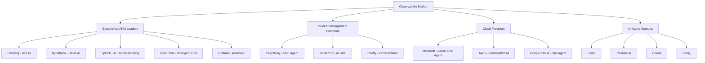

# Observability & SRE Agents: Industry Research (March 2026)

A comprehensive analysis of the observability landscape, AI-powered SRE agents, and the competitive dynamics shaping the space.

---

## Market Overview

| Metric | Value | Notes |
|---|---|---|
| Observability Market (2025) | ~$3.5B–$28.5B | Wide range depending on scope definition |
| AI in Observability Growth | 22.5–24.6% CAGR | Expected to hit $8.7B by 2033 |
| AI Agent Market (2025) | $7.84B | Projected $52.6B by 2030 (46% CAGR) |
| Tool Consolidation | 84% of orgs | Seeking unified observability platforms |

The industry is in a fundamental shift from **reactive monitoring → proactive/autonomous operations**. The key metric is evolving from MTTR (Mean Time to Resolution) to **MTTA (Mean Time to Autonomy)**.

---

## Major Players & Their SRE Agent Strategies

### 1. Datadog — Bits AI SRE Agent

| Aspect | Detail |
|---|---|
| **Product** | Bits AI SRE Agent |
| **Status** | GA since December 2025 |
| **AI Engine** | Proprietary + open-source LLMs, including time-series optimized model |

**Key Capabilities:**
- **Always-on SRE assistant** — assesses infrastructure alerts, fixes code, triages cybersecurity issues
- **Root cause analysis** using high-cardinality telemetry with multi-step reasoning
- **Learns from previous investigations** to improve over time
- **Scans code and suggests fixes** with full production context
- Coordinates incidents, correlates telemetry across the full stack

**Broader AI Ecosystem:**
- **Bits AI Dev Agent** — AI pair programmer with production context
- **Bits AI Security Analyst** — automated security investigation
- **LLM Observability** (GA) — monitors AI model integrity, toxicity, token usage, hallucination rates
- **AI Agent Monitoring** — execution flow graphs and error detection for agentic apps
- Auto-instrumentation for Google ADK (Agent Development Kit)

**Strategic Direction (2026+):**
- "Agentic Shift" — AI agents handle operational tasks, creating self-reinforcing demand
- Transition from passive monitoring to **active operational participant**
- Vision: a **"zero-incident future"**
- Powered by billions of daily data points as proprietary training corpus

---

### 2. Dynatrace — Davis AI & Intelligence Agents

| Aspect | Detail |
|---|---|
| **Product** | Dynatrace Intelligence Agents (powered by Davis AI) |
| **Status** | Announced at Perform 2026 |
| **AI Engine** | Davis AI — deterministic + agentic AI hybrid |

**Key Capabilities:**
- **Closed-loop autonomous outcomes** across IT and business operations
- AI-driven anomaly detection, automated root cause analysis, predictive analytics
- Extends into operational processes to **prevent outages** and automate remediation workflows
- **Domain-specific agents** for SRE, development, and security teams

**Autonomy Roadmap (phased):**
1. Preventive operations
2. Recommendation-driven workflows
3. Supervised autonomy
4. **Full autonomous operations**

**Key Differentiators:**
- First observability platform to integrate with **Microsoft Azure SRE Agent** (Nov 2025)
- Multi-cloud operations expansion (AWS, Azure, Google Cloud)
- "Dynatrace Intelligence" as an **agentic operations system** — merging deterministic and generative AI
- Focus at KubeCon NA 2025: autonomous, agent-driven observability for the AI era

---

### 3. PagerDuty — AI Agent Suite

| Aspect | Detail |
|---|---|
| **Product** | PagerDuty SRE Agent + Scribe/Shift/Insights Agents |
| **Status** | SRE Agent GA ~Q4 2025; Scribe & Shift GA Oct 2025 |
| **Ecosystem** | Partnerships with Anthropic, Cursor, LangChain; MCP server |

**AI Agent Suite:**
- **SRE Agent** — learns from past incidents, recommends & executes diagnostics/remediations, acts as virtual responder
- **Scribe Agent** — auto-transcribes Zoom/chat, provides structured summaries in Slack/Teams
- **Shift Agent** — auto-detects and resolves on-call scheduling conflicts
- **Insights Agent** — context-aware analytics for proactive issue prevention

**Results:** Early adopters reporting **50% faster incident resolution**

**Strategic Direction:**
- SRE Agent evolving to handle detection → triage → initial diagnostics autonomously
- Azure SRE Agent integration (early access Dec 2025)
- Remote MCP server for bidirectional connections with 3rd-party AI agents
- AI and automation embedded in **all paid Incident Management tiers**

---

### 4. Splunk (Cisco) — AI-Powered Observability

| Aspect | Detail |
|---|---|
| **Product** | AI Troubleshooting Agent + AI Agent/Infrastructure Monitoring |
| **Status** | Launched Q1 2026 |
| **Integration** | MCP Server for automated incident resolution |

**Key Capabilities:**
- **AI Agent Monitoring** — oversees performance, quality, cost, security of AI apps/LLMs
- **AI Infrastructure Monitoring** — supports Cisco AI PODs
- **AI Troubleshooting Agent** — correlates MELT data (metrics, events, logs, traces), identifies root causes, suggests remediation
- Real-time detection of model drift, inconsistent responses

**Market Position:** 76% of organizations using AI-powered observability tools (per Splunk's State of Observability 2025)

---

### 5. New Relic — Intelligent Observability

| Aspect | Detail |
|---|---|
| **Product** | SRE Agent + Agentic AI Monitoring + MCP Server |
| **Status** | SRE Agent coming 2026; Agentic Monitoring GA Nov 2025 |
| **Partners** | ServiceNow, Google Gemini, OpenAI, Claude, LangChain, Pinecone, DeepSeek |

**Key Capabilities:**
- **Agentic AI Monitoring** — visibility into autonomous agent interactions with Agents Service Map
- **Logs Intelligence** — AI-automated log analysis
- **MCP Server** — standardized observability protocol for AI agents
- 15+ AI-enabled capabilities including RAG tools

**Vision:** "Observability Beyond Human Scale" — proactive, intelligent platforms that interpret outcomes and take autonomous action

---

### 6. Grafana Labs — AI-Assisted Observability

| Aspect | Detail |
|---|---|
| **Product** | Grafana Assistant + Assistant Investigations |
| **Status** | Assistant GA Oct 2025; Investigations in public preview Nov 2025 |
| **Philosophy** | Explainable, assistive AI; democratizing observability |

**Key Capabilities:**
- **Grafana Assistant** — natural language interface for observability data, query generation, dashboard optimization
- **Assistant Investigations** — autonomous agent system with specialized agents for anomaly detection, system-level incident views, mitigation path suggestions
- GenAI Agent Observability — invocation tracking, cost management, performance monitoring

---

### 7. Microsoft Azure — Azure SRE Agent

| Aspect | Detail |
|---|---|
| **Product** | Azure SRE Agent |
| **Status** | GA March 11, 2026 |
| **AI Engine** | OpenAI + Anthropic Claude models; built-in Python execution |

**Key Capabilities:**
- Proactive issue detection using AI + telemetry
- Multi-layer investigations with hypothesis testing and root cause explanation
- **Memory that learns** from past interactions; continuously explores environment
- **Configurable autonomy** — from recommendations to automated responses within guardrails
- Self-healing workflows via Azure Functions / Logic Apps
- Integrations: Azure Monitor, Application Insights, PagerDuty, ServiceNow, GitHub, Azure DevOps

**Differentiator:** Cloud-provider-native SRE agent — deeply integrated with the Azure ecosystem

---

## Startup & Emerging Players

### incident.io — AI SRE

| Focus | Chat-native (Slack) incident management |
|---|---|
| **Differentiation** | Autonomously investigates incidents, correlates full-stack data, suggests fixes with ~90% accuracy |
| **Positioning** | "Always-on SRE teammate" covering detection → post-mortem |

### Rootly — Intelligent Orchestration

| Focus | AI-driven incident response orchestration |
|---|---|
| **Differentiation** | Bridges observability data with automated actions; "human-in-the-loop" philosophy |
| **Results** | Claims 50–70% MTTR reduction |
| **Positioning** | Shifts SRE from reactive firefighting to proactive problem-solving |

### Other Notable Startups

| Company | Focus |
|---|---|
| **Cleric** | AI SRE agent for autonomous incident investigation |
| **Resolve.ai** | AI-powered operational resolution |
| **Traversal** | AI-assisted troubleshooting |
| **Parity** | AI-driven SRE automated investigations |
| **Ciroos** | AI SRE teammate (raised funding June 2025) |
| **Autonomops.ai** | Autonomous operations |

---

## Key Industry Trends (2025–2026)

### 1. The Agentic Shift
- AI agents moving from assistants to **autonomous operators**
- IDC expects AI agents in 80% of enterprise apps by 2026
- Progression: alerting → recommending → executing → self-healing

### 2. OpenTelemetry (OTel) Adoption
- Growing as the de facto open standard for unified telemetry
- Eliminates vendor lock-in across metrics, logs, and traces
- Key driver for tool consolidation

### 3. The Trust Paradox
- Despite widespread AI adoption, **operational toil paradoxically increased** in 2024–2025
- Engineers spending time verifying AI-generated code/decisions
- AI augments human judgment rather than replacing it
- Effectiveness limited by quality of underlying observability data

### 4. Observability for AI (not just AI for Observability)
- Monitoring AI models themselves — transparency, accountability, resilience
- LLM Observability: hallucination rates, token costs, prompt toxicity, model drift
- Agent observability: execution flows, decision trees, inter-agent interactions

### 5. Cost Management & FinOps
- Observability becoming a tool for GPU cost balancing and dynamic scaling
- FinOps optimization via AI-driven insights becoming standard
- Data ingestion cost management as critical concern

### 6. Evolving Role of SREs
- SREs becoming **"architects of reliability"** — focusing on AI governance and automation
- AI handles routine investigations and pattern recognition
- Humans provide nuanced judgment and creative problem-solving

---

## Competitive Dynamics

### Battlegrounds

| Dimension | Leaders | Challengers |
|---|---|---|
| **Full-stack observability + AI** | Datadog, Dynatrace | Splunk, New Relic |
| **Incident management automation** | PagerDuty | incident.io, Rootly |
| **Cloud-native SRE** | Microsoft Azure | Dynatrace (via Azure integration) |
| **Open/vendor-neutral** | Grafana | New Relic (OTel focus) |
| **AI-first/startup agility** | incident.io, Rootly | Cleric, Resolve.ai, Ciroos |

### Key Moats

1. **Data moat** — Datadog's billions of daily data points as training corpus
2. **Platform breadth** — Dynatrace's deterministic + agentic AI hybrid
3. **Ecosystem lock-in** — Microsoft/Azure's deep cloud integration
4. **Workflow embedding** — PagerDuty's presence in existing on-call/incident workflows
5. **Community/open-source** — Grafana's developer-first approach

---

## Relevance to Our SRE Agent Vision

This research provides critical context for the SRE Agent "Generative User Experience" (GenUX) being designed in previous conversations. Key takeaways:

1. **Every major player is building SRE agents** — the market is converging on autonomous incident response as the future
2. **Differentiation opportunity** lies in the UX layer — most agents focus on backend capability, not the human-AI co-authoring experience
3. **Trust is the bottleneck** — the industry's "trust paradox" validates the need for transparent, explainable AI in SRE workflows
4. **MCP (Model Context Protocol)** is emerging as a standard for agent interoperability (PagerDuty, Splunk, New Relic all adopting)
5. **Memory and continuous learning** are table-stakes (Datadog, Azure SRE Agent both emphasize learning from past incidents)
6. **Configurable autonomy** is the winning pattern — Azure's spectrum from recommendations to automated actions mirrors industry consensus
