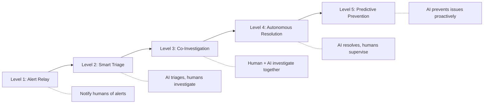

# SRE Agent UI/UX Research (March 2026)

A deep-dive into user experience patterns, interaction paradigms, and design principles across the SRE agent landscape.

---

## Interaction Paradigms — The Four Archetypes

Every SRE agent on the market falls into one (or more) of these UX archetypes:

| Archetype | Description | Products Using It |
|---|---|---|
| **Chat-Native** | Full incident lifecycle inside Slack/Teams | incident.io, PagerDuty, Rootly |
| **Sidebar Copilot** | Context-aware AI panel alongside dashboards | Grafana Assistant, Dynatrace Davis Copilot |
| **Dashboard-Embedded** | AI woven into existing observability views | Datadog Bits AI, Dynatrace Notebooks, Splunk |
| **Autonomous Background Agent** | Runs investigations silently, surfaces results | Azure SRE Agent, Grafana Investigations |

Most products are converging toward **hybrid models** that combine 2–3 archetypes.

---

## Product-Level UX Deep Dive

### 1. Datadog — Bits AI SRE Agent

**Primary Interface:** Dashboard-embedded + Chat delivery (Slack)

**UX Flow:**
1. Alert triggers → Bits AI auto-investigates in background
2. Agent correlates telemetry, forms hypotheses, tests them
3. Delivers conclusions + root cause to Slack with full context
4. Auto-populates incident details and status pages with AI-generated summaries

**Key UX Features:**
- **Voice Interface** (previewed at DASH 2025) — engineers can get details and take action before reaching a computer
- **Handoff Notifications** — smooth transition between AI investigation and human takeover
- **AI-generated incident summaries** auto-populate status pages
- Supports HIPAA workloads with RBAC

**UX Strengths:**
- Reduces cognitive load by delivering conclusions, not raw data
- 95% reduction in time to resolution claimed
- Seamless bridge between background investigation and human decision-making

**UX Gaps:**
- Investigation is largely a black box — limited visibility into the reasoning chain
- Chat delivery is output-only; limited bi-directional co-investigation in Slack

---

### 2. Dynatrace — Davis AI Copilot + Notebooks

**Primary Interface:** Sidebar Copilot + Interactive Notebooks

**UX Flow:**
1. Davis Copilot appears as contextual assistant across Dynatrace UI
2. Users query in natural language → Copilot translates to DQL (Dynatrace Query Language)
3. Notebooks provide rich visualization (meters, gauges, color-coded thresholds)
4. Agentic capabilities (July 2025) enable automated remediation from Copilot

**Key UX Features:**
- **Natural language → DQL translation** — eliminates query language barrier
- **Context-aware** — follows user activity, offers relevant assistance per page
- **Feature Adoption Dashboard** — tracks Copilot engagement, success rates, and productivity impact
- New visualizations: meters, gauges with color-coded visual thresholds
- **Grail data lakehouse** — no manual indexing; ingestion of logs/metrics/traces "just works"

**UX Strengths:**
- Notebooks as a "thinking space" — blends exploration with documentation
- Copilot reduces onboarding friction (new users learn by asking)
- Tracking adoption metrics shows UX maturity in measurement

**UX Gaps:**
- Copilot UI is tightly coupled to Dynatrace platform (not chat-native)
- Agentic actions are relatively new (July 2025) — autonomy UX still evolving
- No evidence of voice or multimodal interfaces

---

### 3. PagerDuty — SRE Agent + Slack Integration

**Primary Interface:** Chat-native (Slack) + Web dashboard

**UX Flow:**
1. Incident detected → SRE Agent auto-triages, surfaces findings in Slack
2. Agent shows: related incidents, change events, runbook-derived next steps
3. Runs targeted diagnostics (log retrieval, deployment comparison)
4. By 2026: SRE Agent embeddable as a "virtual responder" in schedules/escalation policies
5. Scribe Agent transcribes Zoom calls → posts summaries to Slack

**Key UX Features:**
- **Full incident lifecycle in Slack** — trigger, acknowledge, reassign, escalate, resolve via slash commands + interactive buttons
- **Dedicated incident channels** with dynamic conference bridges
- **Redesigned card interface** (Oct 2025) — thread replies to minimize channel noise
- **Configurable permissions** — decide whether to auto-approve agent recommendations
- **Mobile app** — on-call management from anywhere
- Unlicensed Slack users can create PagerDuty incidents (via API keys)

**UX Strengths:**
- Deepest Slack integration in the market
- Card-based UI reduces information overload
- Virtual responder concept = agent as a first-class team member
- Multi-agent suite (SRE + Scribe + Shift + Insights) creates a holistic UX

**UX Gaps:**
- Users report UI can be **overwhelming for new users**
- "Noisy alerts" if rules not properly tuned — configuration UX is a pain point
- Limited granular control over notification customization

---

### 4. incident.io — AI SRE

**Primary Interface:** Chat-native (Slack-first)

**UX Flow:**
1. Incident declared via Slack (slash command or trigger)
2. AI SRE autonomously investigates — correlates telemetry, code changes, past incidents
3. Surfaces root cause with evidence, cites sources
4. Suggests environment-specific fixes (~90% accuracy claimed)
5. Drafts post-mortems automatically

**Key UX Features:**
- **Transparency-first** — AI cites sources and shows evidence for every conclusion
- **Chat-as-primary-interface** — not a notification channel, the actual workspace
- Eliminates context switching entirely
- Role assignment, status updates, resolution all within Slack
- AI can answer codebase-related questions directly in chat

**UX Strengths:**
- Described as "fast, collaborative, and intuitive" by users
- Source citation builds trust (key differentiator)
- 80% automation of incident response → significant toil reduction
- Post-mortem drafting removes the most hated SRE task

**UX Gaps:**
- Deeply coupled to Slack — less useful for Teams-first orgs
- Web dashboard is secondary → complex analysis may feel constrained in chat
- Long-term investigations may be hard to track in threaded chat format

---

### 5. Grafana — Assistant + Investigations

**Primary Interface:** Sidebar Copilot + Autonomous Investigation Agents

**UX Flow (Assistant):**
1. Sidebar chat appears alongside any Grafana page
2. User asks questions in natural language → Assistant generates PromQL/LogQL queries
3. Creates/modifies dashboards, finds data sources, provides best practices

**UX Flow (Investigations):**
1. User describes problem, timeframe, and scope in chat
2. Specialized agents fan out in parallel — exploring metrics, logs, traces, profiles, SQL
3. User monitors investigation progress live
4. Agents build comprehensive incident picture using Knowledge Graph
5. Delivers actionable mitigation recommendations

**Key UX Features:**
- **Context-awareness** — Assistant follows user across pages, maintaining state
- **Live investigation monitoring** — users watch agents work in real-time
- **Query transparency** — users can inspect generated queries
- **Knowledge Graph integration** — connects disparate data points
- Interactive learning experiences (step-by-step tutorials) connected to Assistant

**UX Strengths:**
- Best "show your work" UX — transparent investigation process
- Parallel agent exploration is visually compelling
- Democratizes observability (no need to learn PromQL)
- Open-source DNA = developer trust

**UX Gaps:**
- Limited to Grafana ecosystem (not chat-native)
- Investigations is still in public preview — maturity unclear
- No incident lifecycle management (not a replacement for PagerDuty/incident.io)

---

### 6. Microsoft Azure — SRE Agent

**Primary Interface:** Natural language chat + Azure Portal integration

**UX Flow:**
1. Agent continuously monitors environment, building contextual understanding
2. Detects issues proactively via AI + telemetry
3. Performs multi-layer investigation — tests hypotheses, correlates with recent changes
4. Presents findings with structured operational context and root cause explanation
5. Recommends actions → user configures autonomy level for execution

**Key UX Features:**
- **Configurable autonomy dial** — spectrum from recommendations → automated execution within guardrails
- **Memory and continuous learning** — learns from past interactions, understands routes/configs/handlers
- **Explainable reasoning** — shows what, why, and when for every action
- **Real-time status indicators** + comprehensive audit logs
- **Guardrail taxonomy:**
  - Input constraints
  - Output validation
  - Decision boundaries (triggers human approval)
  - Behavioral rules
- **Role-adaptive UI** — adjusts based on user role and operational context

**UX Strengths:**
- Most sophisticated autonomy configuration model in the market
- Deep integration with Azure ecosystem (Monitor, App Insights, GitHub, DevOps)
- "Agent-first design" following Microsoft's unified design system
- Proactive insight surfacing without explicit prompts

**UX Gaps:**
- Azure-only — not useful for multi-cloud/hybrid environments (without Azure as primary)
- Relatively new (GA March 2026) — real-world UX feedback limited
- Rich features may create steep learning curve for autonomy configuration

---

## Cross-Cutting UX Patterns

### The Autonomy Spectrum

Every product positions somewhere on this spectrum, and the best let users **move along it**:

```
[Notify Only] → [Recommend] → [Act with Approval] → [Act within Guardrails] → [Fully Autonomous]
     ↑              ↑                ↑                        ↑                       ↑
  PagerDuty    Grafana Asst    PagerDuty SRE         Azure SRE Agent           Datadog Bits AI
  (alerts)    (suggestions)    (virtual resp)         (configurable)           (auto-investigate)
```

> [!IMPORTANT]
> **The "Autonomy Dial" is the most critical UX pattern.** Users need to feel in control of how much agency they grant the AI, and this must be adjustable per-action, not just globally.

### Trust-Building Patterns

| Pattern | Used By | Description |
|---|---|---|
| **Source Citation** | incident.io | AI shows evidence and cites data sources for conclusions |
| **Query Transparency** | Grafana | Users can inspect every generated query |
| **Live Investigation View** | Grafana Investigations | Watch agents work in real-time |
| **Audit Logs** | Azure SRE Agent | Complete record of all agent actions and decisions |
| **Confidence Indicators** | General best practice | Show model confidence levels for each recommendation |
| **Intent Preview** | Azure SRE Agent | Show planned actions before execution |
| **Reasoning Chains** | Datadog (partial) | Explain hypothesis → evidence → conclusion flow |
| **Feature Adoption Dashboards** | Dynatrace | Track and measure trust/adoption quantitatively |

### Human-in-the-Loop (HITL) Patterns

| Pattern | Description | Best Implementation |
|---|---|---|
| **Review & Approve** | Agent proposes, human approves/rejects | PagerDuty SRE Agent, Azure SRE Agent |
| **Confidence Escalation** | Below threshold → escalate to human | General pattern (Azure guardrails) |
| **Correction Loop** | Human corrects agent output → agent learns | Datadog (learns from investigations) |
| **Override Controls** | Human can pause/stop/redirect agent at any time | Azure SRE Agent |
| **Graduated Autonomy** | Start conservative, earn more autonomy over time | Dynatrace (phased roadmap) |

---

## Emerging UX Paradigms

### 1. Agentic Experience (AX) — Beyond UX

A new design discipline is emerging called **Agentic Experience (AX)**, focused on how AI agents interact with systems on behalf of humans:

**Core AX Principles:**
- **Human Centricity** — agents are delegates, not replacements
- **Contextual Alignment** — context flows bidirectionally between agent and user
- **Invisible, Not Absent** — agents enhance workflows without requiring separate interfaces
- **Agent Accessibility** — systems designed for agent navigation (clean APIs, structured data)

### 2. Multimodal Interaction

| Modality | Status | Product |
|---|---|---|
| **Text Chat** | Ubiquitous | All products |
| **Voice** | Previewed | Datadog Bits AI Voice |
| **Dashboard Interaction** | Common | Dynatrace, Grafana |
| **Slash Commands** | Common | PagerDuty, incident.io |
| **Interactive Cards** | Growing | PagerDuty (Slack cards) |
| **Natural Language Query** | Growing | Grafana, Dynatrace, Azure |

### 3. Just-in-Time / Dynamic UI

UI components that appear based on context rather than being permanently visible:
- Grafana's sidebar that "follows" the user
- PagerDuty's incident-specific channels
- Dynatrace's per-page Copilot context

---

## UX Maturity Model for SRE Agents



| Level | Current Products | UX Focus |
|---|---|---|
| **L1: Alert Relay** | Legacy monitoring | Notification design |
| **L2: Smart Triage** | PagerDuty (base), Splunk | Prioritization UI, context display |
| **L3: Co-Investigation** | Grafana, Dynatrace, incident.io | Collaboration canvas, reasoning transparency |
| **L4: Autonomous Resolution** | Datadog Bits AI, Azure SRE Agent | Guardrails config, audit trails, intent preview |
| **L5: Predictive Prevention** | Dynatrace (vision), Datadog (vision) | Proactive insight UX, what-if scenarios |

---

## Gap Analysis & Differentiation Opportunities

### What's Missing in the Market

| Gap | Description | Opportunity |
|---|---|---|
| **No "Dynamic Canvas"** | No product offers a true co-authoring space where human and AI build understanding together | The GenUX "Dynamic Canvas" concept fills this gap |
| **Memory is invisible** | Agents learn but users can't see/control what they know | Memory visualization + editing as a feature |
| **Investigation ≠ Story** | Agents dump findings but don't construct a narrative | Narrative-driven incident response |
| **Cross-platform fragmentation** | Chat-native ≠ dashboard ≠ portal — no unified experience | Consistent UX across surfaces |
| **Autonomy is binary** | Most products are either autonomous or manual — few offer a real dial | Granular per-action autonomy controls |
| **Post-mortem is an afterthought** | Generated but not integrated into learning loops | Post-mortem as living knowledge base |
| **Multi-agent UX** | No product surfaces how multiple AI agents coordinate | Multi-agent orchestration visibility |

### The GenUX Opportunity

Based on this research, the biggest UX differentiation for an SRE agent lies at the intersection of:

1. **Transparent reasoning** (Grafana's investigation view) + **Chat-native delivery** (incident.io's Slack-first) + **Configurable autonomy** (Azure's guardrails) + **Memory control** (not yet implemented anywhere)

2. The **"Dynamic Canvas"** concept from previous conversations directly addresses the market's biggest UX gap: no product today lets human and AI truly **co-author** an incident response in a shared workspace.

3. The **trust paradox** (toil increasing despite AI adoption) can be solved through radical transparency — not just showing *what* the AI found, but showing *how it thinks*.

---

## Key Design Principles for SRE Agent UX

Based on patterns observed across all products:

1. **Show your work** — Transparency > Convenience
2. **Meet people where they are** — Slack/Teams integration is table stakes
3. **Let users tune the dial** — Autonomy must be configurable per-action
4. **Build trust incrementally** — Start conservative, earn autonomy through micro-interactions
5. **Reduce cognitive load during incidents** — Deliver conclusions, not raw data
6. **Make memory visible** — If the agent learns, let users see and control what it knows
7. **Design for the team, not the individual** — Incidents are collaborative
8. **Support multimodal interaction** — Chat + voice + dashboard + mobile
9. **Automate the most hated tasks first** — Post-mortems, status pages, scheduling
10. **Measure trust** — Track adoption, override rates, and satisfaction (Dynatrace's approach)
