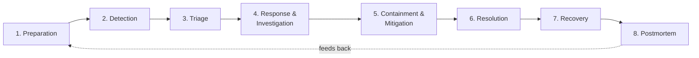
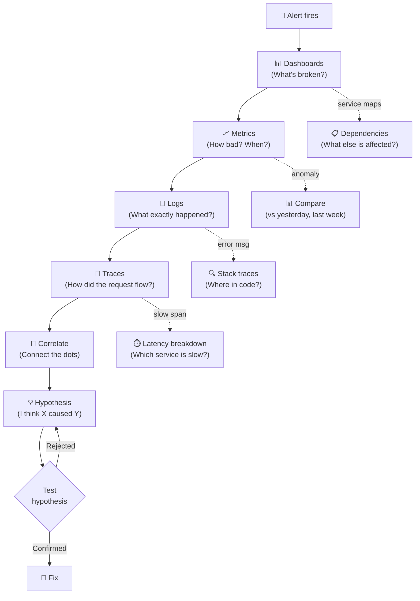
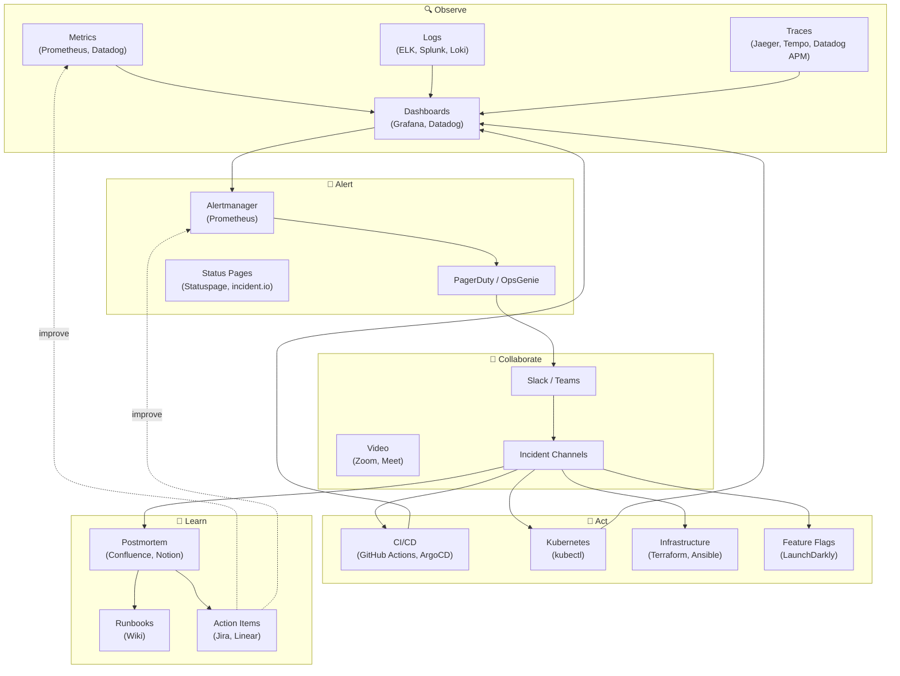
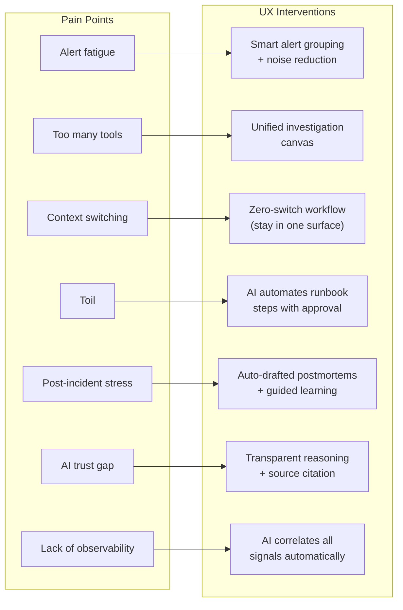

# How SRE Actually Works: The Complete Graph (March 2026)

A deep research document mapping SRE workflows, critical questions, investigation patterns, toolchains, cognitive models, and pain points — everything needed to design the best possible SRE agent UX.

---

## The SRE Incident Lifecycle — 8 Phases

Each phase has **critical questions**, **where engineers look**, and **what tools they use**.

---

## Phase-by-Phase: Questions × Tools × Actions

### Phase 1: Preparation (Before Incidents)

| Critical Questions | Where They Look | Tools |
|---|---|---|
| Are our SLOs/SLIs defined and meaningful? | SLO dashboards, service catalog | Datadog, Nobl9, Grafana |
| Are runbooks up to date? | Wiki, internal docs | Confluence, Notion, Backstage |
| Who's on call and are they ready? | On-call schedules | PagerDuty, OpsGenie |
| Do we have alerts on the right symptoms? | Alert configurations | Prometheus Alertmanager, Datadog |
| What's our error budget status? | Error budget dashboards | Datadog SLOs, Nobl9 |

> [!TIP]
> 99% of SRE teams struggle to define and create SLOs effectively. This is a massive UX opportunity — helping teams create meaningful SLOs through guided workflows.

---

### Phase 2: Detection & Alerting

| Critical Questions | Where They Look | Tools |
|---|---|---|
| Is this a real problem or a false positive? | Alert details, metric graphs | PagerDuty, Prometheus, Grafana |
| How many users are affected? | Error rate dashboards, user-facing monitors | Datadog RUM, Synthetic monitoring |
| When did this start? | Time-series graphs, change events | Grafana, Datadog |
| Is this impacting our SLO/error budget? | SLO burn rate dashboards | All observability platforms |
| What severity level is this? | Impact assessment + severity matrix | PagerDuty, incident.io |

**The Alert Fatigue Problem:**
- 33% of engineers say alert fatigue is their **#1 obstacle** in incident response
- 73% of organizations say false positives are their top challenge
- False positive "very frequent" occurrence rose from 13% → 20% YoY

---

### Phase 3: Triage & Prioritization

| Critical Questions | Where They Look | Tools |
|---|---|---|
| What is the scope/blast radius? | Service maps, dependency graphs | Datadog APM, Dynatrace |
| Which services/components are affected? | Service health dashboards | Grafana, Datadog |
| Is this a known issue? | Past incident database, runbooks | incident.io, Rootly, Confluence |
| What changed recently? (Deployments, configs) | Change log, CI/CD history | GitHub, ArgoCD, Datadog Changes |
| Do we have a runbook for this? | Runbook library | Confluence, Notion, Shoreline |
| Who needs to be involved/notified? | Escalation policies, org chart | PagerDuty, OpsGenie |

**The Context Switching Cost:**
- Regaining deep focus after interruption takes **10–30 minutes**
- Every tool switch during triage = cognitive load spike
- Average SRE uses **2–10 monitoring tools** (most report 6–10 as optimal)

---

### Phase 4: Response & Investigation

This is where SREs spend the **most cognitive effort** and where the "investigation journey" happens.

#### The Observability Investigation Journey

#### Critical Questions by Signal Type

**Metrics Questions:**
| Question | What They're Looking For |
|---|---|
| What's the error rate / latency / throughput? | Overall health signal |
| When did the anomaly start? | Correlate with changes/events |
| Is this a sudden spike or gradual degradation? | Determines urgency and type |
| Are we hitting resource limits? (CPU, memory, disk, connections) | Resource exhaustion pattern |
| How does this compare to normal baseline? | Needs historical comparison |

**Logs Questions:**
| Question | What They're Looking For |
|---|---|
| What error messages are occurring? | Specific failure details |
| Are there stack traces? | Code-level root cause |
| What's the error frequency? Is it increasing? | Trend of the problem |
| Are there new error types that weren't there before? | Caused by a new deployment? |
| What was the request context? (user, endpoint, params) | Reproduction path |

**Traces Questions:**
| Question | What They're Looking For |
|---|---|
| Where in the request path does it slow down/fail? | Specific service/component |
| Which downstream service is the bottleneck? | Dependency failures |
| How many services are affected in the chain? | Cascade scope |
| Is the failure on every request or intermittent? | Pattern (flaky vs hard failure) |
| What's the span breakdown? | Time spent in each component |

**Correlation Questions (The Hardest Part):**
| Question | What They're Looking For |
|---|---|
| Did a deployment coincide with the problem start? | Change-correlated incident |
| Is this happening across all regions or just one? | Infrastructure vs app issue |
| Are there correlated alerts from dependent services? | Cascading failure |
| Has this exact pattern happened before? | Historical match |
| What's different between working and broken instances? | Comparison debugging |

---

### Phase 5: Containment & Mitigation

| Critical Questions | Where They Act | Tools |
|---|---|---|
| Can we roll back the last deployment? | CI/CD pipeline | ArgoCD, Spinnaker, GitHub |
| Can we reroute traffic away from the problem? | Load balancer, DNS | Cloudflare, AWS ALB, Nginx |
| Can we isolate the affected component? | Feature flags, circuit breakers | LaunchDarkly, Istio |
| Is there a safe temporary workaround? | Runbooks, past incidents | Internal docs |
| Is the mitigation working? | Real-time dashboards | Grafana, Datadog |

> [!IMPORTANT]
> **Mitigation-First Mindset:** Google SRE's core philosophy — restore service FIRST, understand root cause SECOND. The UX should support this by making "quick actions" (rollback, reroute, restart) immediately accessible.

---

### Phase 6: Resolution & Eradication

| Critical Questions | Where They Work | Tools |
|---|---|---|
| What is the actual root cause? | Code, configs, infrastructure | IDE, git blame, Terraform |
| What code change fixes this? | Source code | GitHub, GitLab, VS Code |
| How do we verify the fix works? | Staging environment, canary | CI/CD, synthetic tests |
| Are there other places this could happen? | Codebase search | grep, IDE search |
| Do we need to patch data? | Database, caches | Direct DB access, scripts |

---

### Phase 7: Recovery

| Critical Questions | Where They Check | Tools |
|---|---|---|
| Is the service fully restored? | Health checks, dashboards | Monitoring stack |
| Are all regions/pods healthy? | Kubernetes + infra dashboards | K8s dashboard, kubectl |
| Is the error rate back to baseline? | SLO dashboards | Datadog, Nobl9 |
| Any related secondary failures? | Dependent service dashboards | Service mesh |
| Do we need to backfill any data? | Data pipelines, queues | Internal scripts |

---

### Phase 8: Postmortem & Learning

| Critical Questions | Where They Document | Tools |
|---|---|---|
| What was the timeline of events? | Incident channel history | Slack, incident.io |
| What was the root cause? | Investigation findings | Confluence, Notion |
| What went well in our response? | Team reflection | Meeting, survey |
| What could we have done better? | Retrospective | Meeting, survey |
| What action items prevent recurrence? | Follow-up tracker | Jira, Linear, Asana |
| Should we update runbooks/alerts? | Existing runbooks, alert rules | Wiki, Prometheus |

**The Most Hated SRE Task:** 28% of SREs report increased stress *after* incidents due to postmortem/remediation work. Post-mortem writing is universally loathed yet critically important.

---

## The SRE Toolchain Graph

---

## How SREs Spend Their Time

### Ideal vs Reality

| Activity | Google SRE Ideal | Reality (2025 Survey) |
|---|---|---|
| **Engineering Projects** | 50% | ~30% (squeezed out) |
| **Toil** (manual, repetitive) | ≤30% | **57% spend >50% on toil** |
| **On-call & Incidents** | 10% | 15-25% (varies) |
| **Training & Documentation** | 10% | **67% say not enough time** |

### What Is "Toil"?

Toil is work that is **manual, repetitive, automatable, tactical, devoid of enduring value, and scales linearly with service growth.**

**Examples most ripe for AI automation:**
1. Acknowledging and triaging repetitive alerts
2. Copying/pasting commands from runbooks
3. Manual service restarts
4. Quota request handling
5. Database schema changes
6. Writing post-mortems
7. Status page updates
8. On-call handoff communications

---

## Cognitive Load & Mental Models

### Three Types of Cognitive Load in SRE

| Type | Definition | SRE Example | Design Goal |
|---|---|---|---|
| **Intrinsic** | Inherent task difficulty | Understanding distributed consensus | Support with good abstractions |
| **Extraneous** | Unnecessary mental effort from bad tools | Parsing fragmented logs across 5 tools | **Eliminate through better UX** |
| **Germane** | Useful effort for building mental models | Learning how services interact | Facilitate and accelerate |

> [!CAUTION]
> Excessive extraneous cognitive load causes **"cognitive brownout"** — the engineer's mental model breaks down and they start making errors. Curated, incident-specific dashboards reduce this.

### Key Mental Models SREs Use

| Mental Model | How It Works | UX Implication |
|---|---|---|
| **OODA Loop** | Observe → Orient → Decide → Act, repeat | UX should support rapid cycling through these steps |
| **Mitigation-First** | Fix the user impact before understanding root cause | Quick actions > deep analysis in initial triage |
| **Systems Thinking** | Understand cascading dependencies and interactions | Service maps and dependency visualization |
| **5 Whys** | Repeatedly ask "why" to drill to root cause | Guided RCA workflow |
| **Fishbone Diagram** | Categorize causes (People, Process, Tech, Environment) | Multi-dimensional root cause exploration |
| **Fault Tree** | Top-down mapping of failure paths (AND/OR gates) | Visual failure path exploration |
| **Blameless Culture** | Focus on systems, not individuals | Non-judgmental language in UI |
| **Error Budget** | Reliability budget determines deployment velocity | SLO/error budget always visible |
| **Escalation Path** | Self-heal → Automation → Runbook → Expert | Progressive disclosure of complexity |

---

## The Pain Points — Survey Data (2025)

| Pain Point | Stat | Source |
|---|---|---|
| **Toil increasing despite AI** | 57% spend >50% of week on manual tasks | Rootly SRE Report 2025 |
| **Lack of adequate observability** | 51% of SREs | Catchpoint / Rootly |
| **Alert fatigue is #1 obstacle** | 33% of engineers | Industry surveys |
| **False positive rate increasing** | 73% say it's top challenge | Stamus Networks |
| **Not enough time for training** | 67% of SREs | Rootly SRE Report |
| **Increased stress AFTER incidents** | 28% of SREs | Rootly SRE Report |
| **Too many tools** | 89% of MSPs have tool sprawl | Industry surveys |
| **Pressure to ship > reliability** | 67% feel pressured | Industry surveys |
| **SLO definition is hard** | 99% of teams struggle | Industry surveys |
| **AI hasn't reduced toil yet** | Toil up 6% in 2024 | Rootly SRE Report |
| **General burnout** | 66% of employees | Robert Half 2025 |

---

## The UX Opportunity Map

Mapping each pain point to a design intervention for the SRE Agent:

### What This Means for GenUX Design

| SRE Reality | Design Principle |
|---|---|
| SREs navigate dashboards → metrics → logs → traces | **The investigation journey should flow naturally** without tool switches |
| The hardest part is **correlation** across signal types | AI should **connect the dots**, not just display data |
| Mitigation-first = fix before understanding | **Quick action buttons** should be more prominent than deep analysis |
| OODA loop needs rapid cycling | **Real-time, adaptive UI** that updates as the situation evolves |
| 57% of time is toil | **Automate everything on the toil list** and show what was automated |
| Cognitive brownout from too much data | **Curated, incident-specific views** — show only what matters NOW |
| Post-mortems are hated but essential | **AI drafts post-mortems in real-time** as the incident unfolds |
| 33% alert fatigue | **AI triages and groups alerts**, only escalates what matters |
| Trust in AI is declining | **Show all reasoning, cite all sources**, let users verify |
| 67% not enough training time | The agent UX **teaches as it works** — explain why each step matters |
